Contains projects, assignments, etc... related to Workshop on India's RISC-V program, Cohort 2. Aim is to design and tape out a  RISC-V reference chip using the SCL180 (Semi-Conductor Laboratory 180nm) CMOS process.
## Table of Contents
- [Task1 - RISC-V Toolchain Setup Tasks & Uniqueness Test](#task1---risc-v-toolchain-setup-tasks--uniqueness-test)
  - [1. Installation Steps](#1-installation-steps)
    -[1.1 unique_test.c Output](#-a-unique-test)
  - [2. Errors Encountered, Causes, and Solutions](#2-errors-encountered-causes-and-solutions)

# Task1 - RISC-V Toolchain Setup Tasks & Uniqueness Test

Task 1 is to setup the RISC-V tool chain and successfully compile and run a test program.
Here explaining all the steps to follow, errors faced, debug steps and final results.
This project sets up a RISC-V development environment using the following tools:

- **Ubuntu** (Native installation or via VirtualBox on Windows)
- **Spike** (RISC-V ISA Simulator)
- **Proxy Kernel (pk)** (Boot loader used with Spike)
- **Icarus Verilog** (Verilog simulation tool)

My system specifications: Ubuntu 22.04 LTS, available disk space: >400GB

The installation steps are mainly taken from the Task1 pdf file which shared and some places modified because of incompactability and version issues. The one which I successfully done in my PC, it is given below. 

## 1. Installation Steps

### Step 1: Install Dependencies
Added some missing libarries which not present in the pdf.

Install the required packages for building the toolchain, Spike, and PK: 

Open terminal from the Home location.

```bash
sudo apt-get update
sudo apt-get install -y autoconf automake autotools-dev curl python3 python3-pip libmpc-dev libmpfr-dev libgmp-dev gawk build-essential bison flex texinfo gperf libtool patchutils bc zlib1g-dev libexpat-dev ninja-build git cmake libglib2.0-dev libboost-dev device-tree-compiler libc6-dev
```
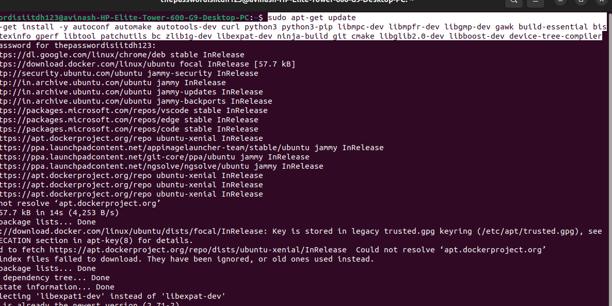

### Step 2: Create Installation Directory
Set up a directory for the toolchain components and change terminal directory to the newly generated folder:

```bash
mkdir -p ~/riscv_toolchain
cd ~/riscv_toolchain
```
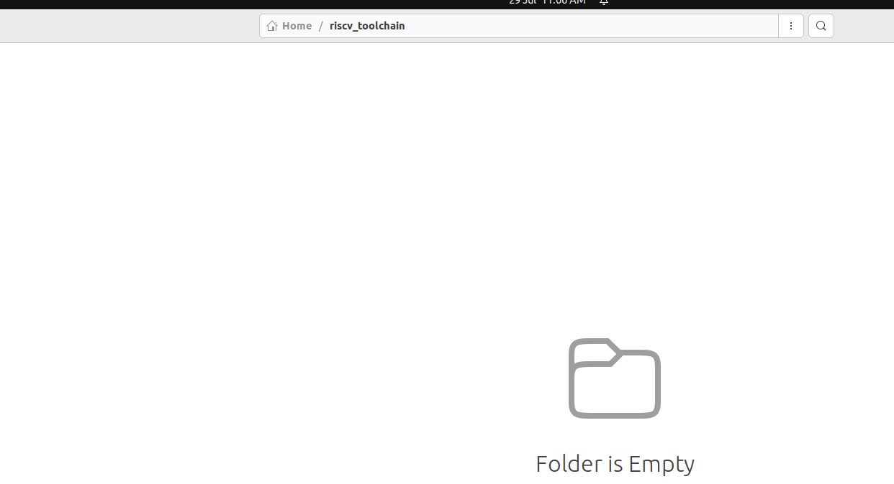

### Step 3: Install RISC-V GNU Toolchain

Note: The step given in the pdf is old, so I changed to new updated version one.
Clone and un-compress the RISC-V GNU toolchain and remove the compressed file:

```bash
wget https://github.com/xpack-dev-tools/riscv-none-elf-gcc-xpack/releases/download/v13.2.0-2/xpack-riscv-none-elf-gcc-13.2.0-2-linux-x64.tar.gz
tar -xvf xpack-riscv-none-elf-gcc-13.2.0-2-linux-x64.tar.gz
mv xpack-riscv-none-elf-gcc-13.2.0-2 riscv64-none-elf-gcc
rm xpack-riscv-none-elf-gcc-13.2.0-2-linux-x64.tar.gz
```
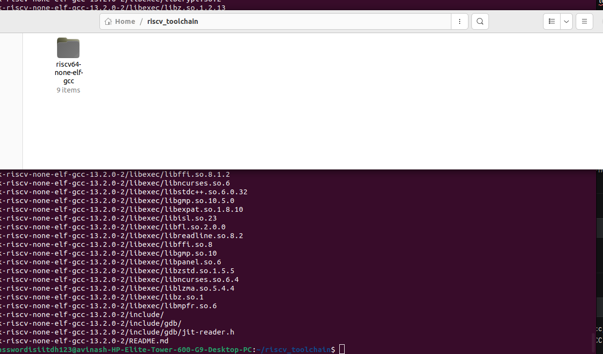

Add to PATH:

```bash
export PATH=$HOME/riscv_toolchain/riscv64-none-elf-gcc/bin:$PATH
echo "export PATH=$HOME/riscv_toolchain/riscv64-none-elf-gcc/bin:\$PATH" >> ~/.bashrc
source ~/.bashrc
```
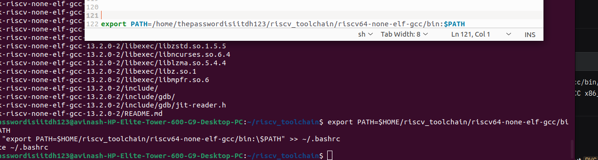

Verify:

```bash
which riscv-none-elf-gcc
riscv-none-elf-gcc --version
```
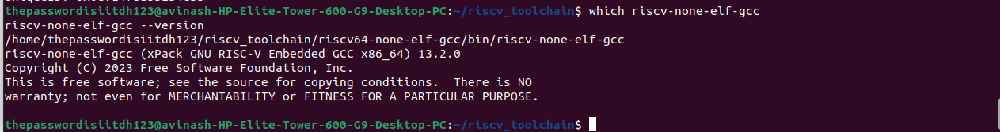

### Step 4: Install Spike Simulator

Clone and build the Spike RISC-V ISA simulator:

```bash
cd ~/riscv_toolchain
git clone https://github.com/riscv/riscv-isa-sim
cd riscv-isa-sim
mkdir build
cd build
../configure --prefix=$HOME/riscv_toolchain/spike
make -j$(nproc)
make install
```
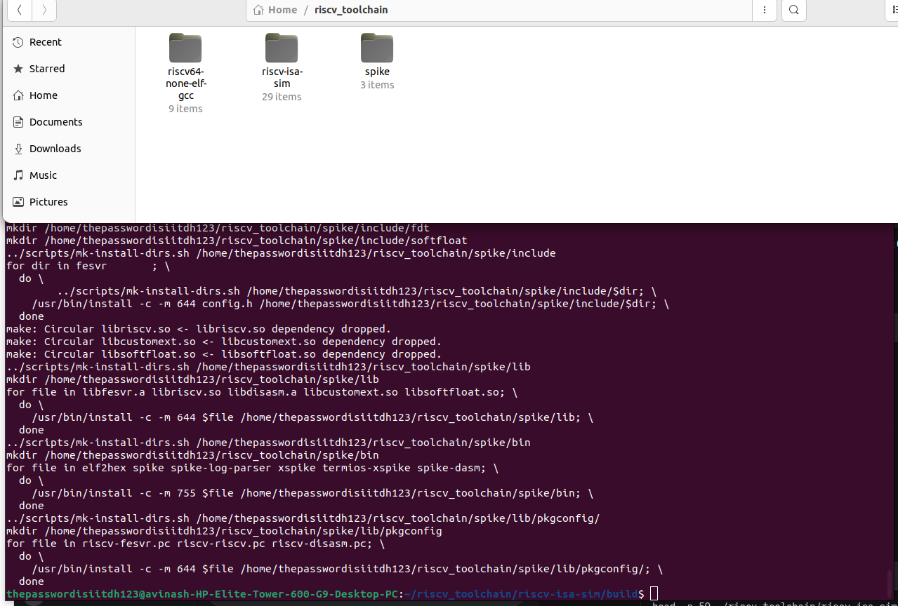

Add to PATH:

```bash
export PATH=$HOME/riscv_toolchain/spike/bin:$PATH
echo "export PATH=$HOME/riscv_toolchain/spike/bin:\$PATH" >> ~/.bashrc
source ~/.bashrc
```
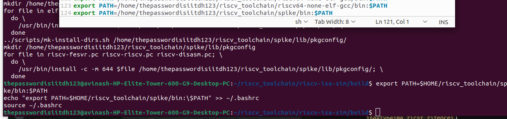

Verify:

```bash
which spike
spike -h
```
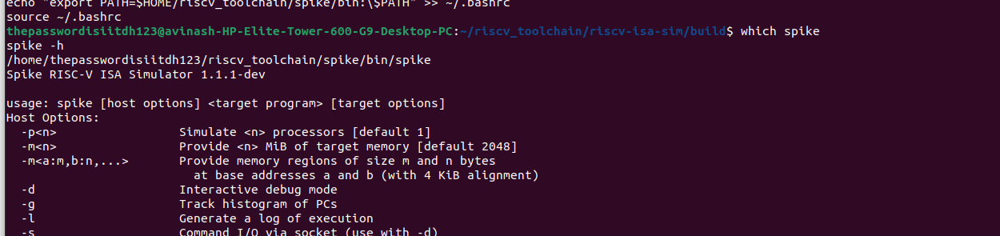

### Step 5: Install RISC-V Proxy Kernel (PK)

Small modification in the configuration from the pdf.

Clone and build the RISC-V Proxy Kernel:

```bash
cd ~/riscv_toolchain
git clone https://github.com/riscv/riscv-pk
cd riscv-pk
mkdir build
cd build
../configure --prefix=$HOME/riscv_toolchain/pk --host=riscv-none-elf CC="riscv-none-elf-gcc -march=rv64ima_zicsr_zifencei -mabi=lp64 -DMEM_START=0x80000000" CXX="riscv-none-elf-g++ -march=rv64ima_zicsr_zifencei -mabi=lp64 -DMEM_START=0x80000000" LD="riscv-none-elf-ld"
make CFLAGS="-march=rv64ima_zicsr_zifencei -mabi=lp64 -O2 -std=gnu99 -Wall -D__NO_INLINE__ -mcmodel=medany -fno-delete-null-pointer-checks -fno-PIE -fno-stack-protector -U_FORTIFY_SOURCE -DMEM_START=0x80000000"
make install
```
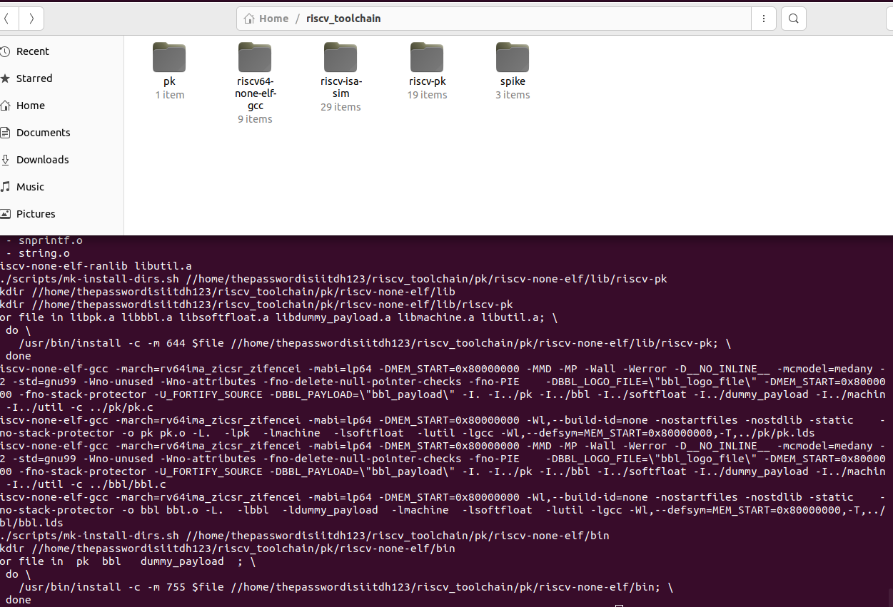

Add to PATH:

```bash
export PATH=$HOME/riscv_toolchain/pk/riscv-none-elf/bin:$PATH
echo "export PATH=$HOME/riscv_toolchain/pk/riscv-none-elf/bin:\$PATH" >> ~/.bashrc
source ~/.bashrc
```
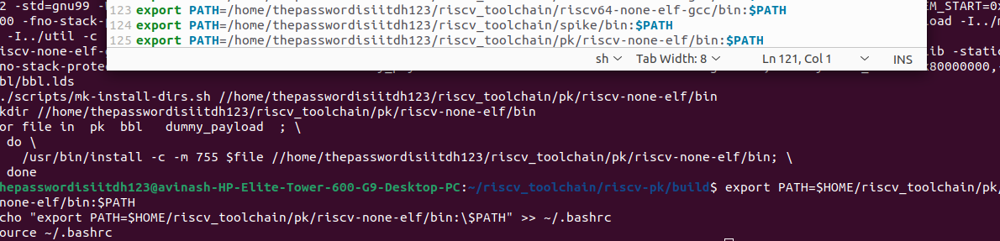

Verify:

```bash
which pk
file ~/riscv_toolchain/pk/riscv-none-elf/bin/pk
```
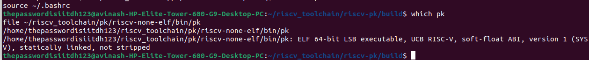

### Step 6: Final Sanity Check

Final confirmation of all tools which we installed above

```bash
which riscv64-unknown-elf-gcc
riscv64-unknown-elf-gcc -v
which pk
which spike
spike -h
```


### Step 7: Install Icarus Verilog

Clone and build the Icarus Verilog:

```bash
cd ~/riscv_toolchain
git clone https://github.com/steveicarus/iverilog.git
cd iverilog
git checkout --track -b v10-branch origin/v10-branch
git pull
chmod +x autoconf.sh
./autoconf.sh
./configure
make -j$(nproc)
sudo make install
```
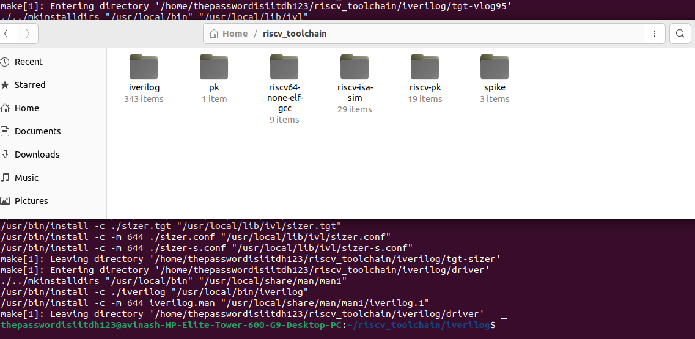

### A Unique Test

Testing the setups using a sample program. The program will take input as USERNAME and HOSTNAME and then produce a unique number.

First creating a sample program named 'unique_test.c'

```
#include <stdint.h>
#include <stdio.h>
#ifndef USERNAME
#define USERNAME "unknown_user"
#endif
#ifndef HOSTNAME
#define HOSTNAME "unknown_host"
#endif
// 64-bit FNV-1a
static uint64_t fnv1a64(const char *s) {
const uint64_t FNV_OFFSET = 1469598103934665603ULL;
const uint64_t FNV_PRIME = 1099511628211ULL;
uint64_t h = FNV_OFFSET;
for (const unsigned char *p = (const unsigned char*)s; *p; ++p) {
h ^= (uint64_t)(*p);
h *= FNV_PRIME;
}
return h;
}
int main(void) {
const char *user = USERNAME;
const char *host = HOSTNAME;
char buf[256];
int n = snprintf(buf, sizeof(buf), "%s@%s", user, host);
if (n <= 0) return 1;
uint64_t uid = fnv1a64(buf);
printf("RISC-V Uniqueness Check\n");
printf("User: %s\n", user);
printf("Host: %s\n", host);
printf("UniqueID: 0x%016llx\n", (unsigned long long)uid);
#ifdef __VERSION__
unsigned long long vlen = (unsigned long long)sizeof(__VERSION__) -
1;
printf("GCC_VLEN: %llu\n", vlen);
#endif
return 0;
}
```

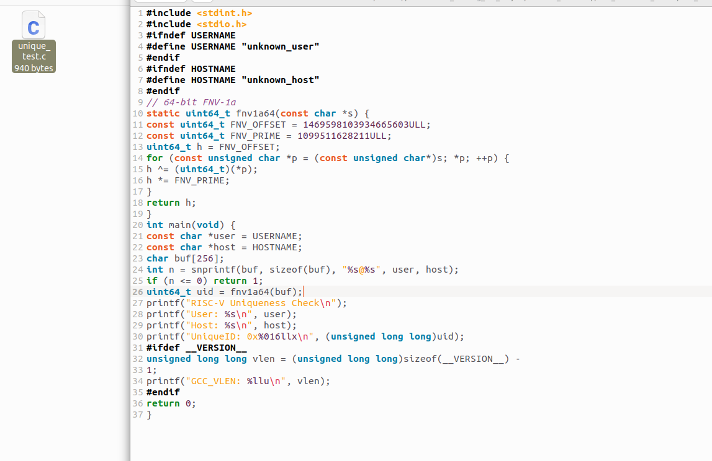

Open terminal on the folder and execute given commands.

```bash
riscv-none-elf-gcc -O2 -Wall -march=rv64ima -mabi=lp64 -DUSERNAME=\"Yadu\" -DHOSTNAME=\"HP_pc\" unique_test.c -o unique_test
spike ~/riscv_toolchain/pk/riscv-none-elf/bin/pk ./unique_test
```

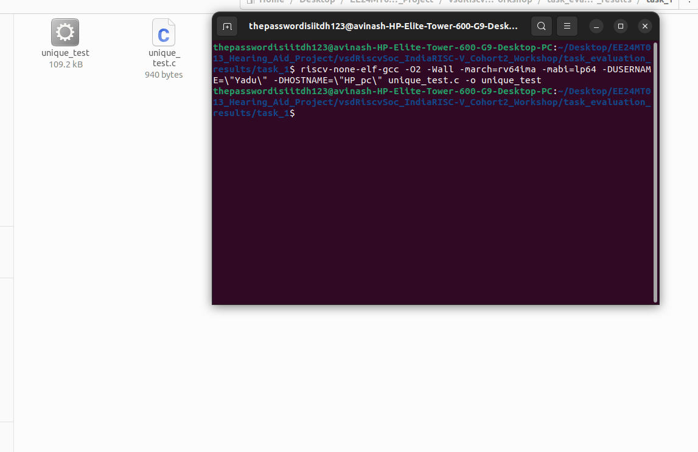

Give the excat location of pk.

```bash
spike ~/riscv_toolchain/pk/riscv-none-elf/bin/pk ./unique_test
```

Output

```
RISC-V Uniqueness Check
User: Yadu
Host: HP_pc
UniqueID: 0x25f9d0de68deed86
GCC_VLEN: 6
```

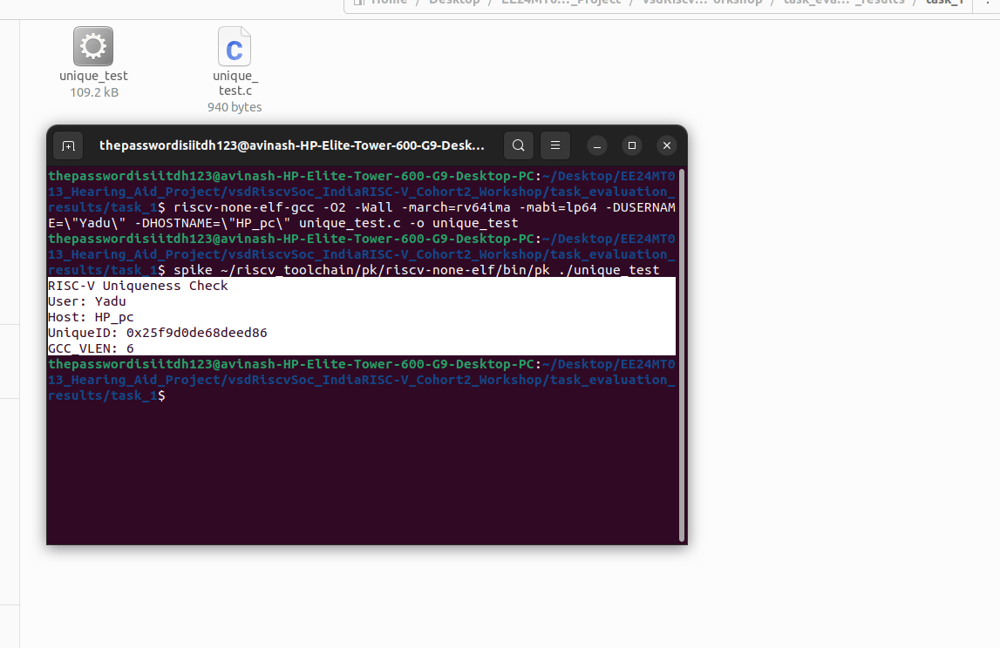

## 2. Errors Encountered, Causes, and Solutions

Below are the errors faced during the Installation process, causes and how they resolved.

### Error 1: `spike` Not Found

- **Command**:

  ```bash
  which spike
  ```
- **Output**:

  ```
  Command 'spike' not found, did you mean:
    command 'spine' from deb cacti-spine (1.2.19-1)
    command 'spipe' from deb spiped (1.6.2-1)
  Try: sudo apt install <deb name>
  ```
  - **Cause**:
  - The Spike simulator was not installed.
  - The `make install` step for `riscv-isa-sim` was either not run or failed.
- **Solution**:
  - Rebuilt and installed Spike
  - Updated the 'PATH'

### Error 2: `pk` Not Found After Installation

- **Command**:

  ```bash
  which pk
  ```
- **Output**: No output.
- **Cause**:
  - The `pk` binary was in `~/riscv_toolchain/pk/riscv-none-elf/bin`, but the `PATH` did not include this directory. Incorrectly added `~/riscv_toolchain/pk/bin` to the `PATH`, which is not exist.
- **Solution**:
  - Updated the `PATH` to include the correct directory.
    
### Error 3: Spike Configure Fails with `libpthread` Missing

- **Command**:
  ```bash
  cd ~/riscv_toolchain/riscv-isa-sim/build
  ../configure --prefix=$HOME/riscv_toolchain/spike --host=riscv-none-elf --with-isa=rv64ima_zicsr_zifencei
  make -j$(nproc)
  make install
  ```
- **Output**:
  ```
  configure: WARNING: unrecognized options: --with-isa
  ...
  checking for pthread_create in -lpthread... no
  configure: error: libpthread is required
  make: *** No targets specified and no makefile found. Stop.
  make: *** No rule to make target 'install'. Stop.
  ```
- **Cause**:
  - The `libpthread` library (part of `libc6-dev`) was missing, causing the configure script to fail.
- **Solution**:
  - Installed `libc6-dev`:
    ```bash
    sudo apt-get update
    sudo apt-get install -y libc6-dev
    ```

### Error 4: Compilation Errors for `unique_test.c`
- **Command**:
  ```bash
  riscv-none-elf-gcc -O2 -Wall -march=rv64imac_zicsr_zifencei -mabi=lp64 -DUSERNAME="$(id -un)" -DHOSTNAME="$(hostname -s)" unique_test.c -o unique_test
  ```
- **Output**:
  ```
  unique_test.c: In function 'main':
  <command-line>: error: 'thepasswordisiitdh123' undeclared (first use in this function)
  unique_test.c:23:45: note: in expansion of macro 'USERNAME'
     23 |     snprintf(input, sizeof(input), "%s@%s", USERNAME, HOSTNAME);
        |                                             ^~~~~~~~
  <command-line>: error: 'avinash' undeclared (first use in this function)
  unique_test.c:23:55: note: in expansion of macro 'HOSTNAME'
     23 |     snprintf(input, sizeof(input), "%s@%s", USERNAME, HOSTNAME);
        |                                                       ^~~~~~~~
  ...
  unique_test.c:28:31: warning: format '%llx' expects argument of type 'long long unsigned int', but argument 2 has type 'uint64_t' {aka 'long unsigned int'} [-Wformat=]
  ```
- **Cause**:
  - **Undeclared Identifiers**: The `-DUSERNAME="$(id -un)"` and `-DHOSTNAME="$(hostname -s)"` flags passed unquoted strings
  - **Format Specifier Warning**: The `printf` format `%llx` was incorrect
- **Solution**:
  - Modified `unique_test.c` to use `%lx`:
  - Used quoted macro definitions:

### Error 5: `Specified ELF can't be mapped: No such device`

- **Command**:
  ```bash
  spike pk ./unique_test
  ```
- **Output**:
  ```
  terminate called after throwing an instance of 'std::invalid_argument'
    what():  Specified ELF can't be mapped: No such device
  ```
- **Cause**:
  - Spike failed to load the `pk` or `unique_test` ELF binary due to:
    - **Compressed Instructions (RVC)**: Both `pk` and `unique_test` used `-march=rv64imac_zicsr_zifencei`, including `RVC`, which was not fully supported by Spike or `pk`.
    - **ISA Mismatch**: The binaries’ ISA did not align with Spike’s runtime ISA.
    - **Memory Configuration**: The memory layout (`MEM_START=0x80000000`) was not specified in the Spike command.
- **Solution**:
  - Rebuilt `pk` and `unique_test` without `RVC` using `-march=rv64ima_zicsr_zifencei`
  - Ran Spike with explicit ISA and memory settings
