# Task 2 - Prove Your Local RISC-V Setup (Run, Disassemble, Decode)
## Goal
- Run RISC-V C programs on your own machine (compiled with your local toolchain, executed with spike pk).
- For each program, generate assembly and include a screenshot of the main: section. Manually decode RISC-V integer instructions and document them in your GitHub repos-
itory.
- Ensure outputs are unique to your PC by embedding username, hostname, machine ID, and timestamps.

## Contents

  - [1. Setting up](#1-setting-up)
  - [2. Build, run, produce assembly and disassembly](#2-build-run-produce-assembly-and-disassembly)
  - [3. Instruction decoding (integer type)](#3-instruction-decoding-integer-type)
  - [4. Final results](#4-final-results)

## 1. Setting up

First we are going to make all the .c and .h files on the local PC which given in the task2.pdf. Then opening the Linux terminal on the **same folder** which we saved the .c and .h file.
In the terminal running some commands to set the identity variables in Linux host shell so each build is user/machine specific. The commands and screen shots are given below.

### Step 1: Saving the .c and .h files in local PC

The files are attached here.
- [unique.h](unique.h)
- [factorial.c](factorial.c)
- [bitots.c](bitots.c)
- [bubble_sort.c](bubble_sort.c)
- [max_array.c](max_array.c)

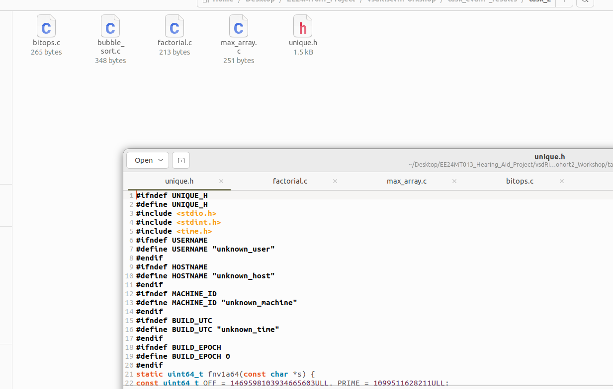

### Step 2: Setting the identity variables

``` bash
export U=$(id -un)
export H=$(hostname -s)
export M=$(cat /etc/machine-id | head -c 16)
export T=$(date -u +%Y-%m-%dT%H:%M:%SZ)
export E=$(date +%s)
```

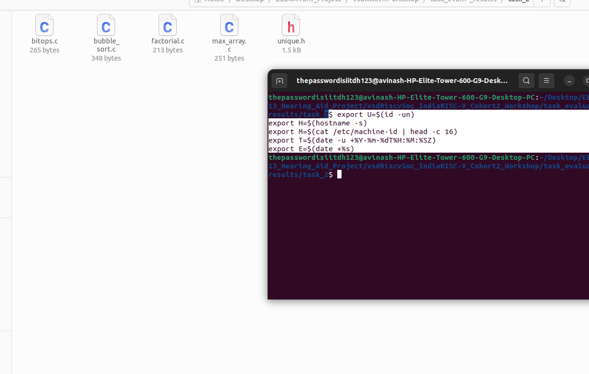

### Step 3: Checking the version of tool chain and simulator

Here we are just checking the version of tool chain and simulator to verify the installation.

- Tool chain version
  
``` bash
riskv-none-elf-gcc --version
```

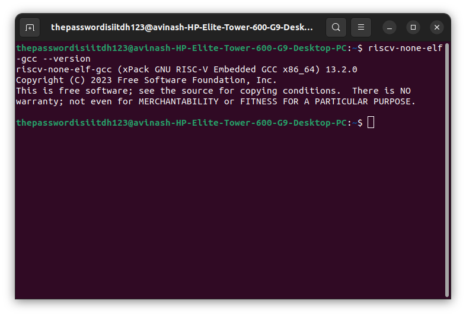

- Simulator version
  
``` bash
spike -h
```

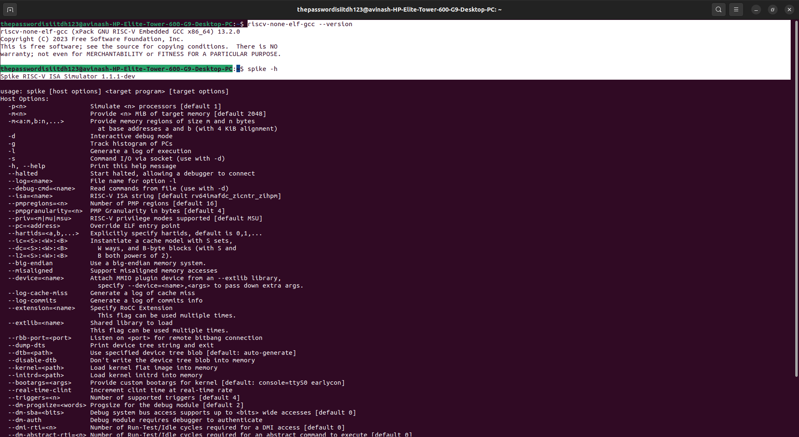

## 2. Build, run, produce assembly and disassembly

Here doing the build, run, assembly and diaassembly of all the .c file which we made earlier. For that we are using the same opened terminal just before.
If it is closed, open again from the same folder and do the setting identity variable step again to set the variables for the current shell secession.
Then follow the given terminal commands. The screenshots also given along with each commands.

### 1. factorial.c

- **Build (factorial.c)**
  
``` bash
riscv-none-elf-gcc -O0 -g -march=rv64ima -mabi=lp64 \
-DUSERNAME="\"$U\"" -DHOSTNAME="\"$H\"" -DMACHINE_ID="\"$M\"" \
-DBUILD_UTC="\"$T\"" -DBUILD_EPOCH=$E \
factorial.c -o factorial
```
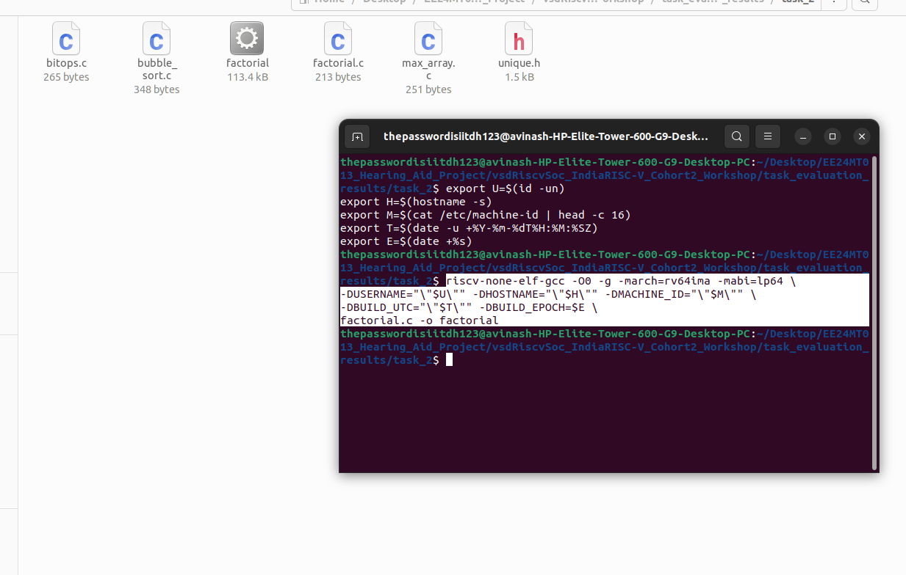

- **Run (factorial.c)**

``` bash
spike ~/riscv_toolchain/pk/riscv-none-elf/bin/pk ./factorial
```
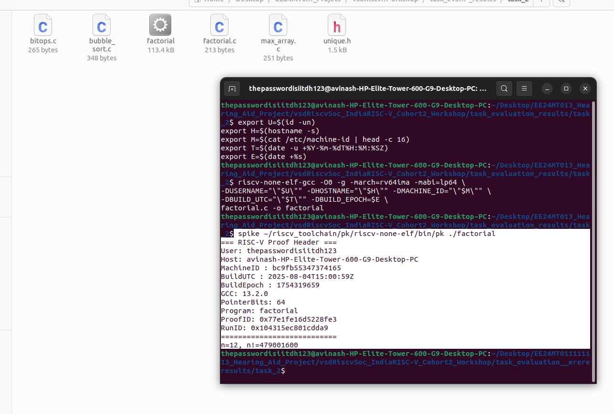

- **Assembly (factorial.c)**

``` bash
riscv-none-elf-gcc -O0 -S factorial.c -o factorial.s
```
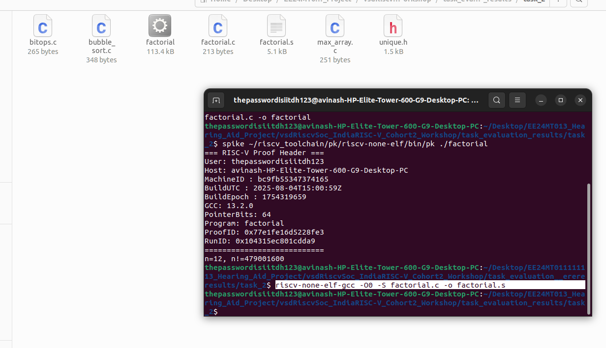

- **Disassembly (factorial.c)**

``` bash
riscv-none-elf-objdump -d ./factorial | sed -n '/<main>:/,/^$/p' | tee factorial_main_objdump.txt
```
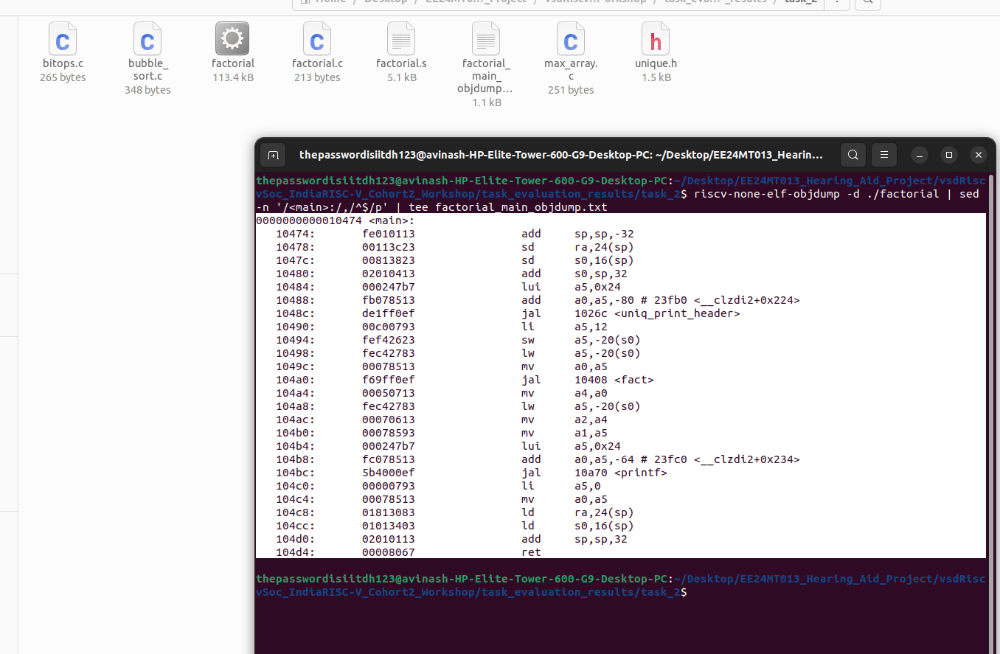

### 2. bitops.c

- **Build (bitops.c)**
  
``` bash
riscv-none-elf-gcc -O0 -g -march=rv64ima -mabi=lp64 \
-DUSERNAME="\"$U\"" -DHOSTNAME="\"$H\"" -DMACHINE_ID="\"$M\"" \
-DBUILD_UTC="\"$T\"" -DBUILD_EPOCH=$E \
bitops.c -o bitops
```
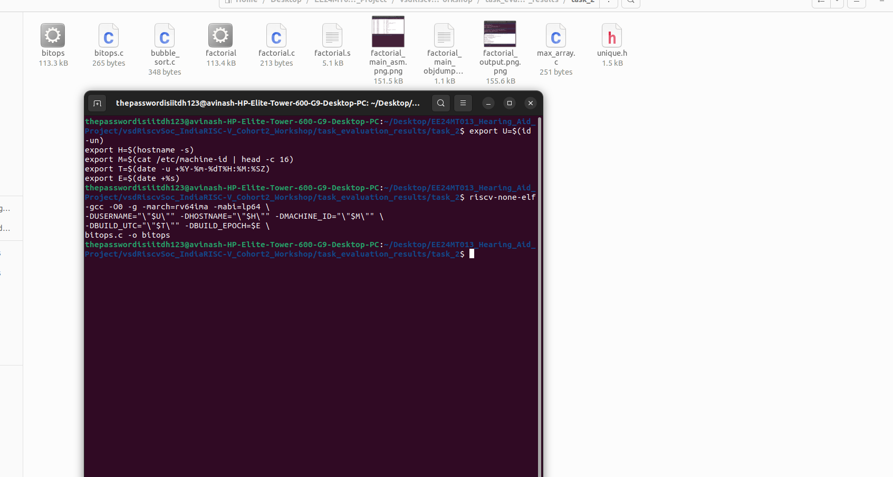

- **Run (bitops.c)**

``` bash
spike ~/riscv_toolchain/pk/riscv-none-elf/bin/pk ./bitops
```
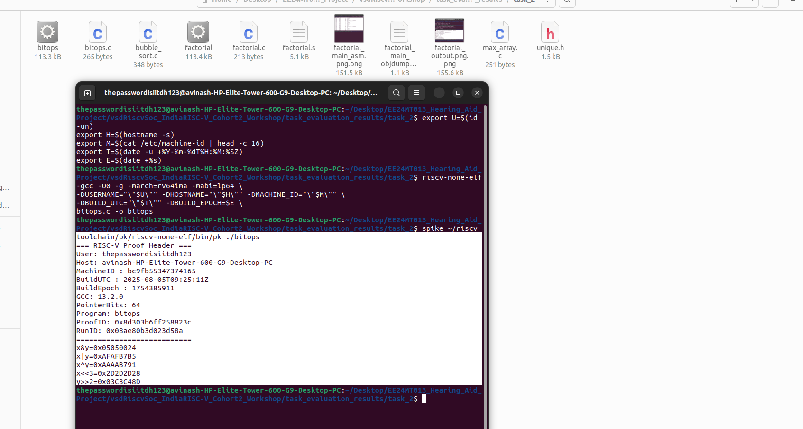

- **Assembly (bitops.c)**

``` bash
riscv-none-elf-gcc -O0 -S bitops.c -o bitops.s
```
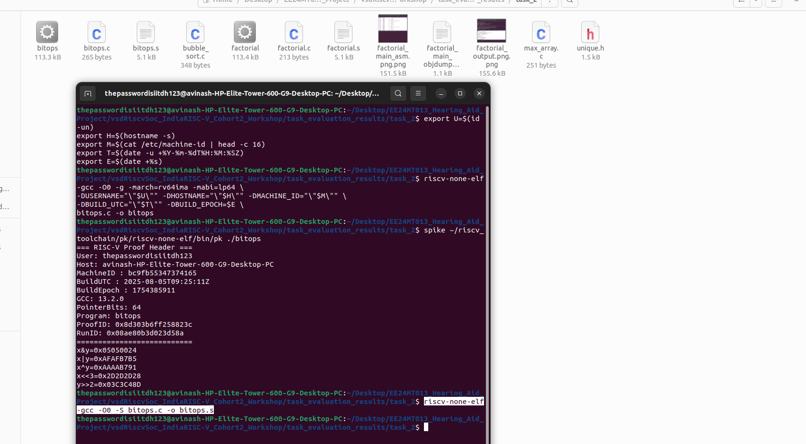

- **Disassembly (bitops.c)**

``` bash
riscv-none-elf-objdump -d ./bitops | sed -n '/<main>:/,/^$/p' | tee bitops_main_objdump.txt
```
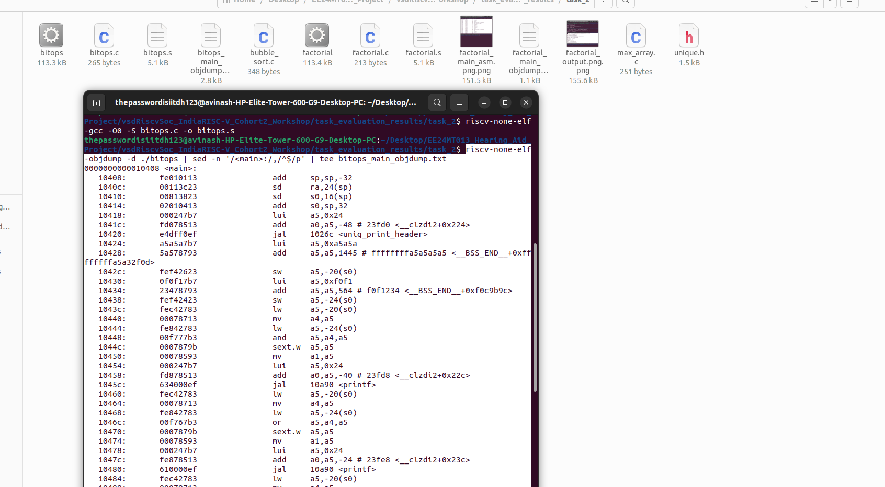

### 3. bubble_sort.c

- **Build (bubble_sort.c)**
  
``` bash
riscv-none-elf-gcc -O0 -g -march=rv64ima -mabi=lp64 \
-DUSERNAME="\"$U\"" -DHOSTNAME="\"$H\"" -DMACHINE_ID="\"$M\"" \
-DBUILD_UTC="\"$T\"" -DBUILD_EPOCH=$E \
bubble_sort.c -o bubble_sort
```
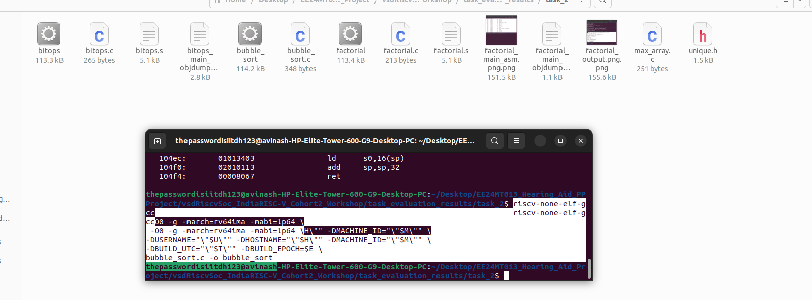

- **Run (bubble_sort.c)**

``` bash
spike ~/riscv_toolchain/pk/riscv-none-elf/bin/pk ./bubble_sort
```
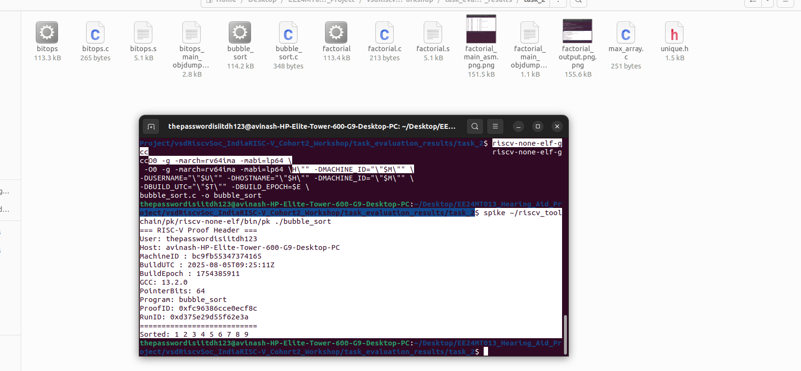

- **Assembly (bubble_sort.c)**

``` bash
riscv-none-elf-gcc -O0 -S bubble_sort.c -o bubble_sort.s
```
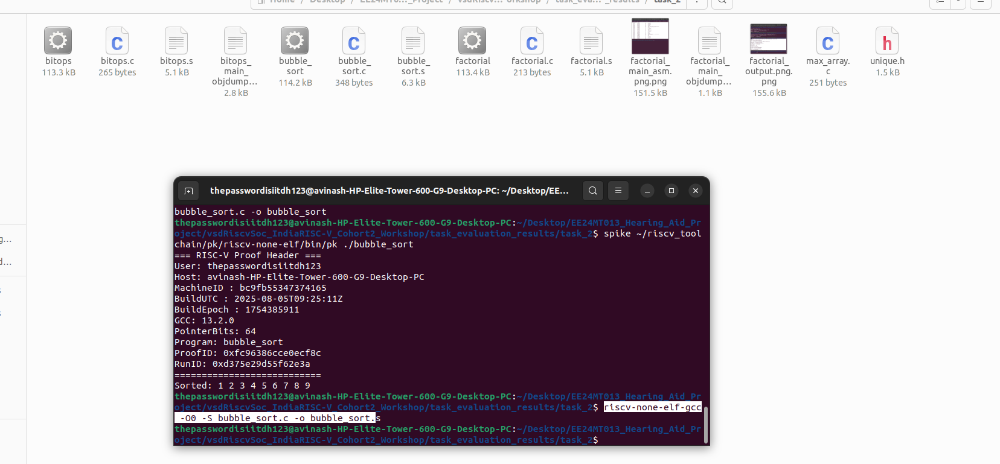

- **Disassembly (bubble_sort.c)**

``` bash
riscv-none-elf-objdump -d ./bubble_sort | sed -n '/<main>:/,/^$/p' | tee bubble_sort_main_objdump.txt
```


### 4. max_array.c

- **Build (max_array.c)**
  
``` bash
riscv-none-elf-gcc -O0 -g -march=rv64ima -mabi=lp64 \
-DUSERNAME="\"$U\"" -DHOSTNAME="\"$H\"" -DMACHINE_ID="\"$M\"" \
-DBUILD_UTC="\"$T\"" -DBUILD_EPOCH=$E \
max_array.c -o max_array
```
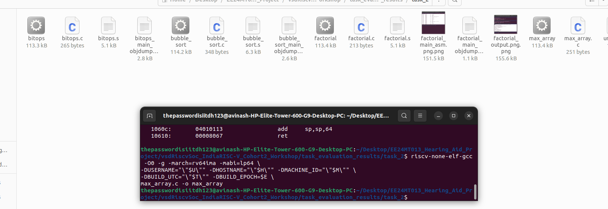

- **Run (max_array.c)**

``` bash
spike ~/riscv_toolchain/pk/riscv-none-elf/bin/pk ./max_array
```
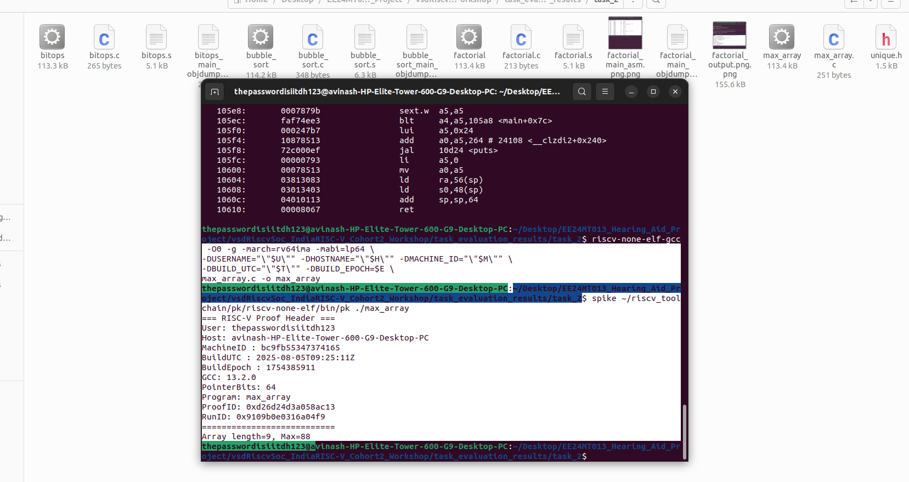

- **Assembly (max_array.c)**

``` bash
riscv-none-elf-gcc -O0 -S max_array.c -o max_array.s
```
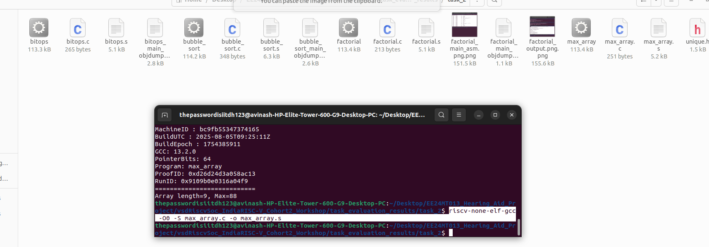

- **Disassembly (max_array.c)**

``` bash
riscv-none-elf-objdump -d ./max_array | sed -n '/<main>:/,/^$/p' | tee max_array_main_objdump.txt
```
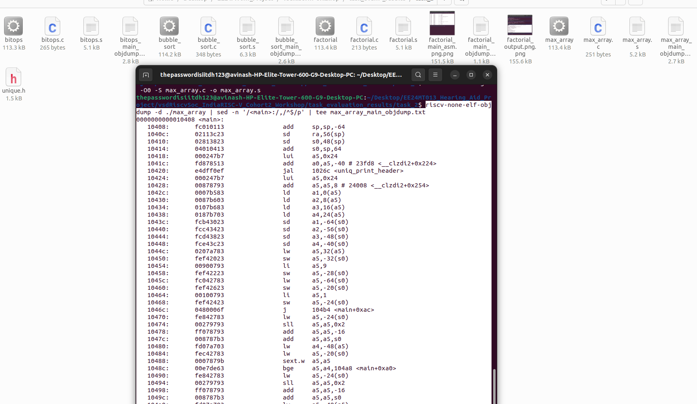

## 3. Instruction decoding (integer type)
Here we are decoding some RISC-V integer instructions from the `.s` or `.objdump` file. The below table contains all the decoded values.
*I taken the reference from a pdf file named [RISC-V Reference.pdf](../../documents/RISC-V_ref.pdf), it is attached here. It contains all the Instruction sets and registers details.*

|Instruction      |Opcode  |rd     |rs1    |rs2     |funct3|funct7 |Binary                          |Description        |
|-----------------|--------|-------|-------|--------|------|-------|--------------------------------|-------------------|
|addi sp, sp, -32 |0010011 |sp(x2) |sp(x2) |--------|000   |-------|11111110000000010000000100010011|sp = sp + -32      |
|lui a5, 0x24     |0110111 |a5(x15)|-------|--------|------|-------|00000000000000100100011110110111|a5 = 0x24 << 12    |
|lw a5, -20(s0)   |0000011 |a5(x15)|s0(x8) |--------|010   |-------|11111110110001000010011110000011|a5 = M[s0 + -20]   |
|or a5, a4, a5    |0110011 |a5(x15)|a4(x14)|a5(x15) |110   |0000000|00000000111101110110011110110011|a5 = a4 | a5       |
|xor a5, a4, a5   |0110011 |a5(x15)|a4(x14)|a5(x15) |100   |0000000|00000000111101110100011110110011|a5 = a4  ^ a5      |
|mv a4, a5        |0010011 |a4(x14)|a5(x15)|--------|000   |-------|00000000000001111000011100010011|a4 = a5 + 0        |
|blt a4, a5, 105a8|1100011 |-------|a4(x14)|a5(x15) |100   |-------|11111010111101110100111011100011|if(a4 < a5) PC = 105a8|


## 4. Final results

All the output screenshots and the files are present in the folder named `task_evaluation_results/task2` (current folder).

- [bitops_main_asm.png](bitops_main_asm.png)
- [bitops_output.png](bitops_output.png)
- [bubble_sort_main_asm.png](bubble_sort_main_asm.png)
- [bubble_sort_output.png](bubble_sort_output.png)
- [factorial_main_asm.png](factorial_main_asm.png)
- [factorial_output.png](factorial_output.png)
- [max_array_main_asm.png](max_array_main_asm.png)
- [max_array_output.png](max_array_output.png)
